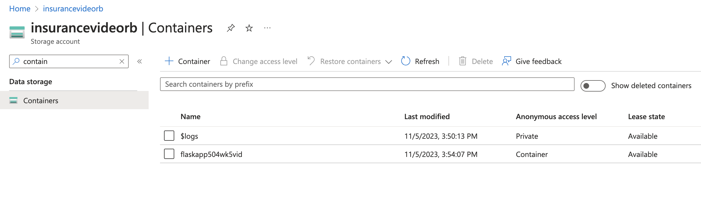
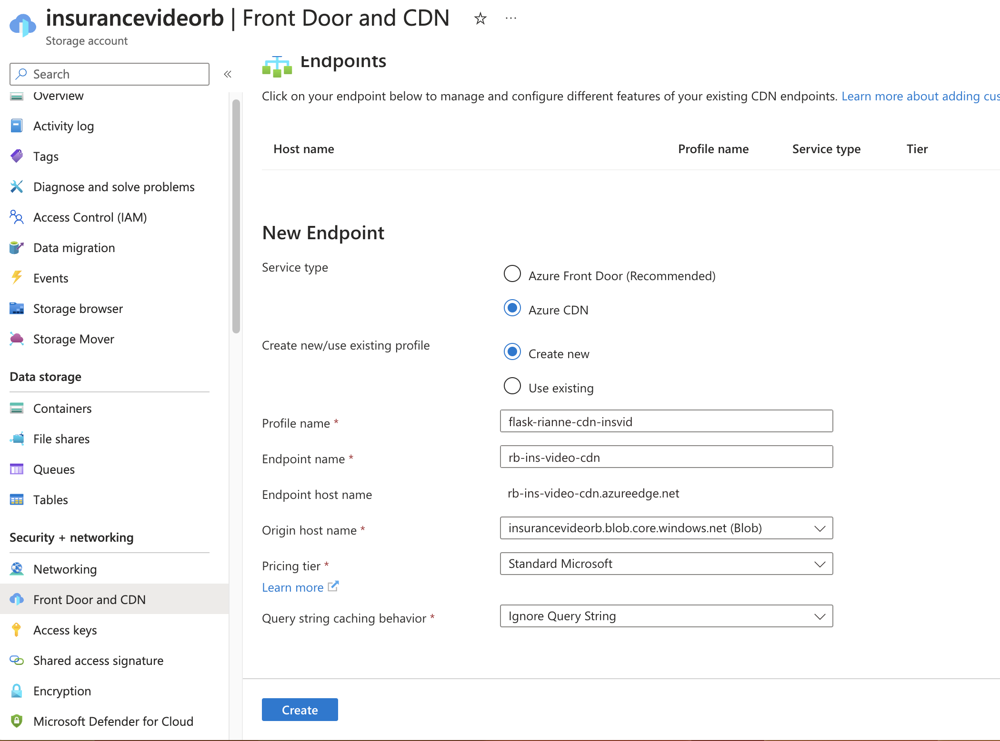
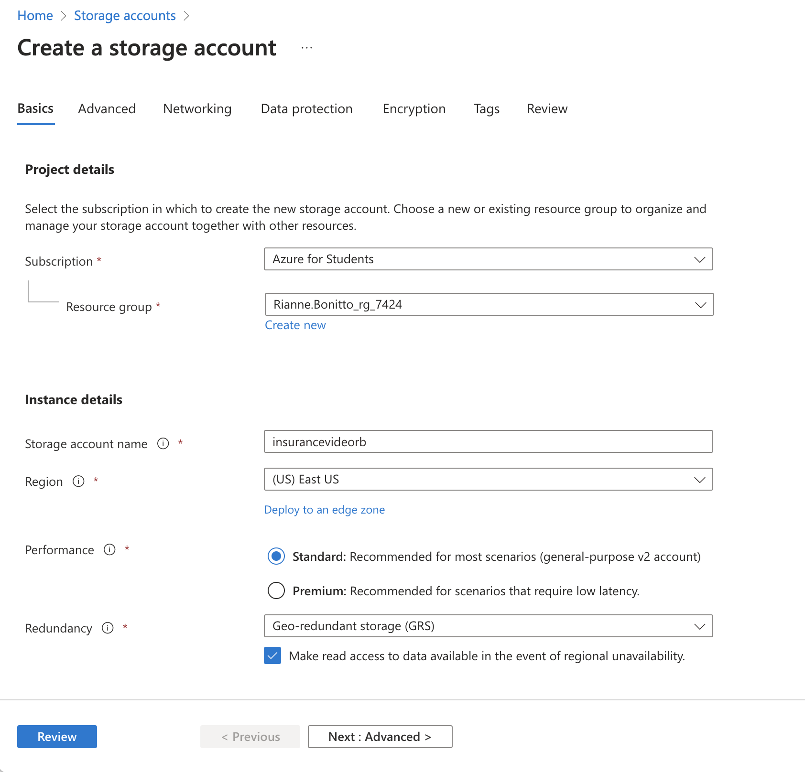
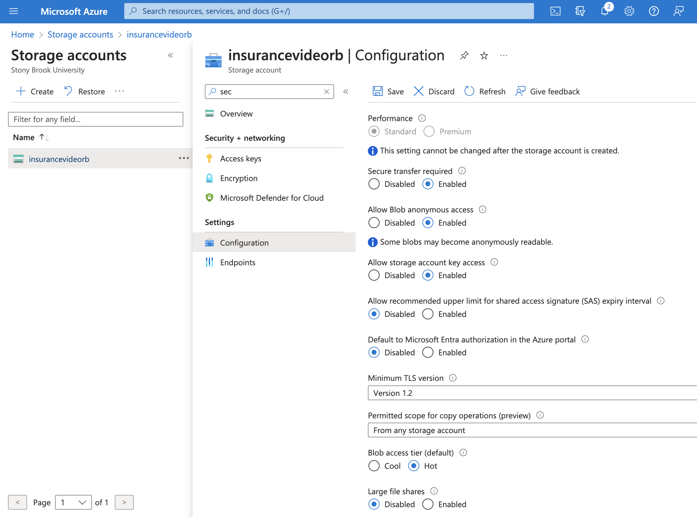
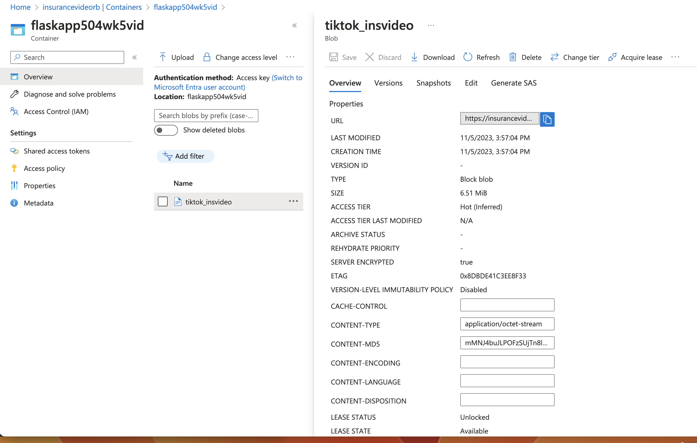
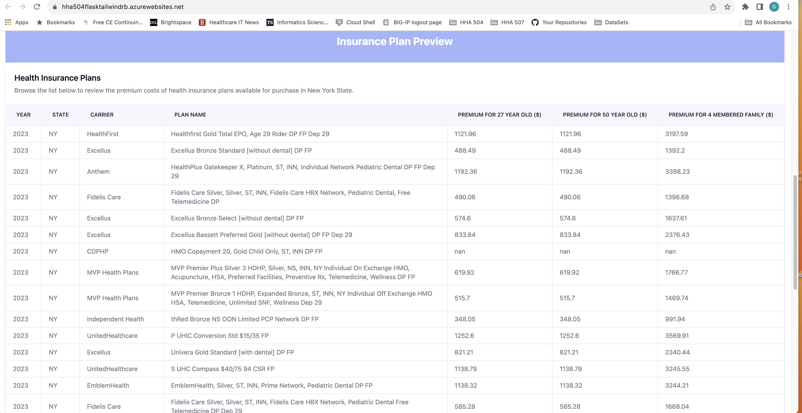
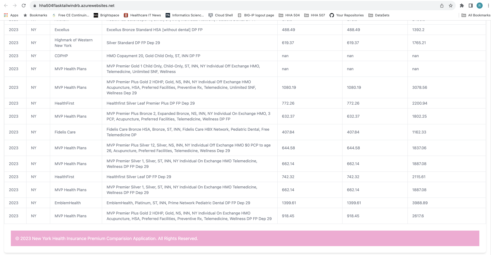
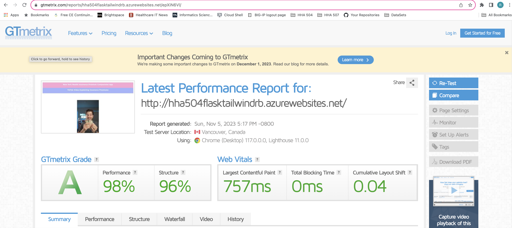
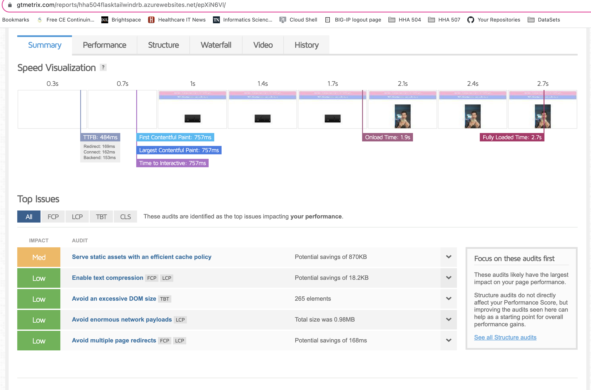
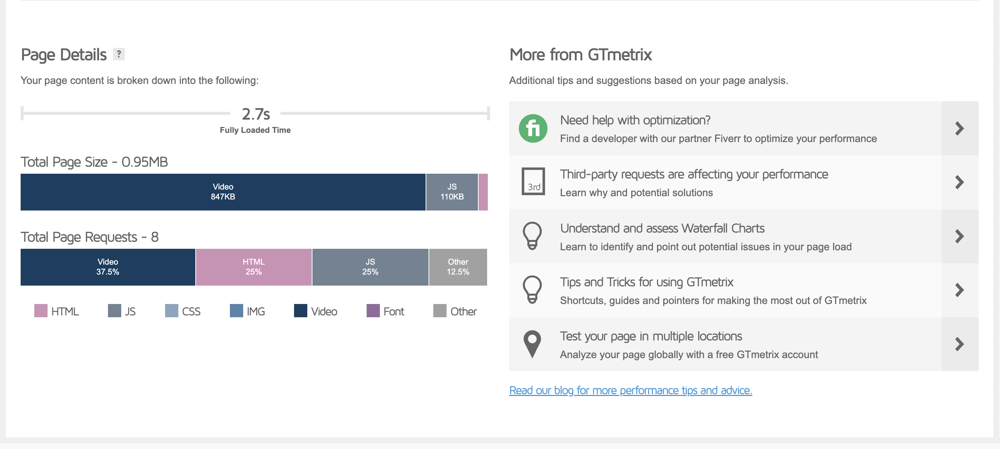

# HHA 504 Week 5: Video Hosting, Flask App and Cloud Deployment

## CDN

### CDN setup

### CDN integration into Flask

## Flask app deployed using Azure app services (screenshot)

### Steps for deploying Flask app to cloud platform

### Design Rationale and Principles Followed

### Responsive design (screenshot)

## Validate Asset Delivery - Using GTmetrix (screenshots)

<b> CDN link confirmed via GTmetrix </b>

## Observations and Benefits of using a CDN and cloud deployment

## Troubleshooting

1. Had to convert the video from a document to an mp4, then upload video to the azure container as an mp4 file to be able to play in the flask app